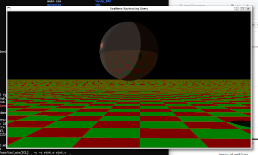

# rtrt

A simple "real time" raytracer which traces its origins back to 2011.  It was nothing special
back then, but might be fun to experiment with now.

In 2025, I decided that it might be an interesting test of AI coding assistants, so I decided
to ask Github's copilot to convert it to a Python program using the taichi language extension,
which can utilize gpu acceleration.  

It eventually succeeded, but it took several tries.  Some of the challenges I encountered:

- It didn't seem to understand the (admittedly sloppy) use of C preprocessor directives, 
effectively ignoring the code inside `#if 1` blocks.  Once I told it that it should include
that code it correctly grocked the version.
- It repeatedly tried to do first definition of variables inside conditional blocks.  Despite
the fact that the values were defined in all code paths, taichi does not seem to tolerate that. 
When I asked Copilot about it, it admitted that it was true, and corrected the error.
- It didn't handle the recursion properly.  Frankly, I didn't understand what it was doing wrong,
but when told about it, it seemed to do something that helped. 
- The image was inverted.  I fixed it by hand.

What's kind of interesting is that using `ti.gpu` mode is actually _slower_ than if I use `ti.cpu`
mode.  I'm not sure what's going on here, but I met my goal of trying to use github's Copilot in a 
non trivial way, so I am going to call it a day for now.
